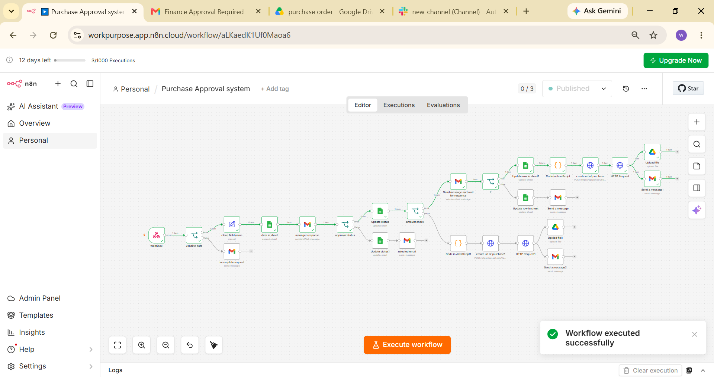
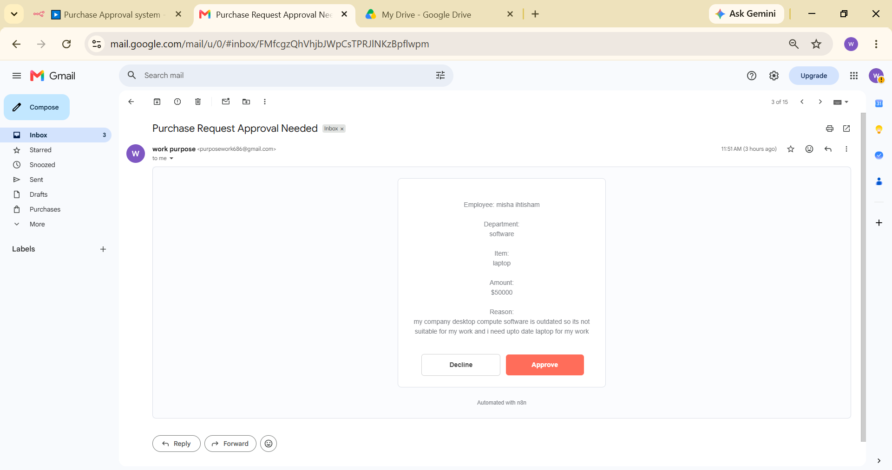
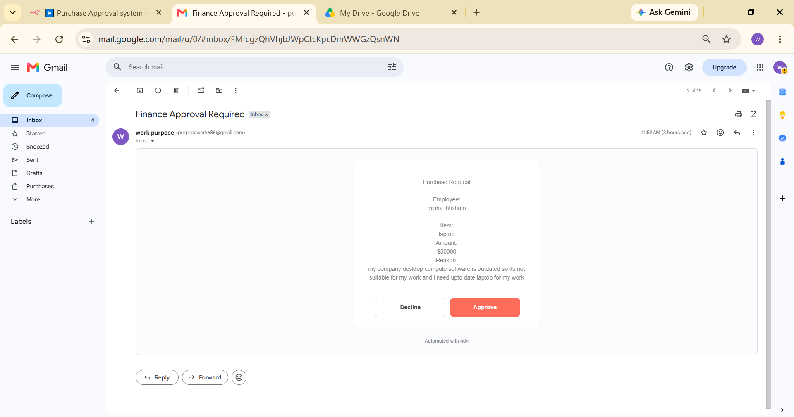
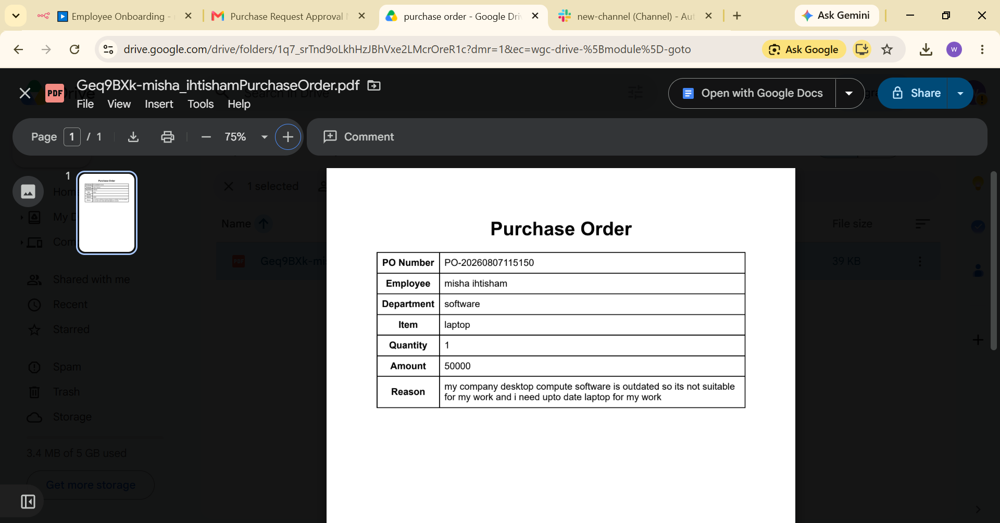
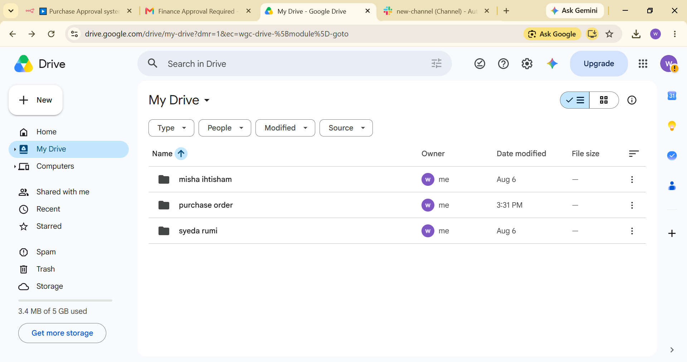
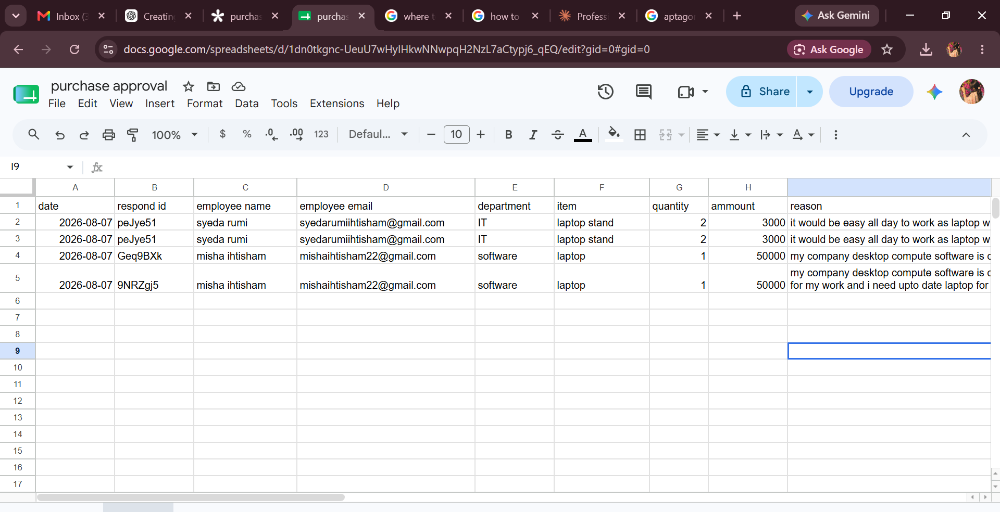
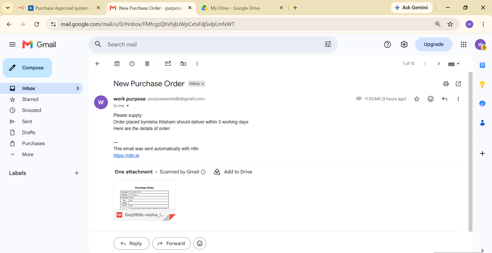

# 🛒 Purchase Approval Automation


An AI-powered purchase approval workflow built using **n8n**, **Google Workspace**, **Google Drive**, **PDF Generator**, and **OpenAI**.

---

# 📌 Overview

This workflow automates the purchase approval process from the moment an employee submits a purchase request until the approved Purchase Order PDF is generated and stored in Google Drive.

The workflow performs the following tasks:

- Receives purchase request
- Validates submitted information
- Routes request for approval
- Waits for manager decision
- Generates Purchase Order PDF
- Stores PDF in Google Drive
- Sends confirmation email
- Updates approval records automatically

---

# ✨ Features

- 🤖 AI-assisted workflow
- 📄 Automatic Purchase Order PDF generation
- ☁️ Google Drive storage
- 📧 Email notifications
- ✅ Approval workflow
- 📊 Google Sheets integration
- ⚡ Fully automated approval process

---

# 🛠 Technologies Used

- n8n
- Google Forms
- Google Sheets
- Gmail
- Google Drive
- PDF Generator
- OpenAI
- JavaScript

---

# 📂 Project Structure

```text
purchase-approval-automation/
│
├── README.md
├── LICENSE
├── workflow.json
└── screenshots/
    ├── workflow.png
    ├── approval-email.png
    ├── finance-approval.png
    ├── purchase-order-pdf.png
    ├── drive-folder.png
    ├── approval-sheet.png
    └── vendor-email.png

```

# 📸 Workflow Screenshots

## 1. Complete Workflow



---

## 2. Approval Email



---

## 3. Finance Approval



---

## 4. Purchase Order PDF



---

## 5. Google Drive Folder



---

## 6. Approval Sheet



---

## 7. Vendor Email



---

# 🚀 How to Use

1. Download the repository.
2. Import **workflow.json** into n8n.
3. Configure Google credentials.
4. Configure OpenAI credentials.
5. Configure the PDF Generator.
6. Execute the workflow.

---

# 📄 License

This project is licensed under the MIT License.

⭐ If you found this project useful, consider giving it a star!

---

